# 🎓 RMSys SPT — Student Progress Tracking Portal

<a href="https://rmsysspt.onrender.com/">
  
</a>

<p align="center">
  
  
  
  
  
</p>

> A full-featured learning management and student progress tracking system built for **RMSys Solutions** to manage coding bootcamp students across multiple tracks, mentors, quizzes, attendance, and more.

---

## 📌 Table of Contents

- [Overview](#overview)
- [Features](#features)
- [Tech Stack](#tech-stack)
- [Roles & Permissions](#roles--permissions)
- [Project Structure](#project-structure)
- [Getting Started](#getting-started)
- [Environment Variables](#environment-variables)
- [Database](#database)
- [Email Configuration](#email-configuration)
- [Deployment](#deployment)
- [Key Concepts](#key-concepts)
- [Screenshots](#screenshots)
- [License](#license)

---

## Overview

The **SPT Portal** (Student Progress Tracking) is a web application built with ASP.NET Core MVC and PostgreSQL. It allows a coding bootcamp to manage the full student lifecycle — from enrollment, weekly progress logging, mentor review, quiz tracking, attendance, leaderboards, and certificate issuance.

The system supports three distinct user roles (Admin, Mentor, Student) each with their own dashboard and set of capabilities.

---

## ✨ Features

### 👨‍🎓 Student
- Personal dashboard with **weekly verified hours**, **all-time hours**, and progress bar (resets every Monday)
- Submit daily **progress logs** (max 5 hours/day enforced)
- View assigned **curriculum modules** per track
- Take **module quizzes** and view scores
- Track **module completion** progress
- View **leaderboard** rankings
- Access **resource library** per track
- Submit **capstone project** when modules are complete
- Download **certificate** on completion
- Raise **support tickets**
- Toggle **dark/light mode**
- Update **profile picture** and **password**

### 👨‍🏫 Mentor
- Mentor dashboard with student performance overview
- View and manage **assigned students** (or all students for General mentors)
- **Review and approve/reject** student progress logs
- View student **quiz scores** and **module quiz scores**
- Manage **curriculum** (create, edit, delete, toggle modules and resources)
- View **attendance records**
- **Message students** and other mentors via email
- Review **capstone submissions**
- Access **leaderboard**
- Manage **resource library**
- Update **profile picture** and **password**

### 🛡️ Admin
- Full **master dashboard** with system-wide analytics
- Manage all **students** and **mentors** (create, view, reset passwords)
- **Manage Tracks** — add new tracks, rename, activate/deactivate (auto-creates 19 modules per new track)
- **Manage Curriculum** across all tracks
- Review all **progress logs** system-wide
- View all **quiz scores** and **module quiz scores**
- **Issue certificates** to qualifying students
- Post **announcements**
- Manage **support/help desk tickets**
- View full **audit logs** (who did what and when)
- Access **attendance** system
- Manage **resource library**

---

## 🛠 Tech Stack

| Layer | Technology |
|---|---|
| Framework | ASP.NET Core 8 MVC |
| Language | C# |
| ORM | Entity Framework Core |
| Database | PostgreSQL (hosted on Render) |
| Authentication | ASP.NET Core Identity |
| Frontend | Bootstrap 5.3, Font Awesome 6, vanilla JS |
| Email | Gmail SMTP via custom `IEmailService` |
| Hosting | Render.com |
| Version Control | GitHub |

---

## 👥 Roles & Permissions

| Feature | Student | Mentor | Admin |
|---|:---:|:---:|:---:|
| View own dashboard | ✅ | ✅ | ✅ |
| Submit progress logs | ✅ | ❌ | ❌ |
| Approve progress logs | ❌ | ✅ | ✅ |
| Take quizzes | ✅ | ❌ | ❌ |
| Manage curriculum | ❌ | ✅ | ✅ |
| Manage tracks | ❌ | ❌ | ✅ |
| Create students/mentors | ❌ | ❌ | ✅ |
| Reset passwords | ❌ | ❌ | ✅ |
| Issue certificates | ❌ | ❌ | ✅ |
| View audit logs | ❌ | ❌ | ✅ |
| View leaderboard | ✅ | ✅ | ✅ |
| Manage library | ❌ | ✅ | ✅ |

---

## 📁 Project Structure

```
SPT/
├── Controllers/
│   ├── AdminController.cs         # Admin-only actions
│   ├── MentorController.cs        # Mentor actions
│   ├── StudentController.cs       # Student actions
│   ├── AttendanceController.cs
│   ├── LeaderboardController.cs
│   ├── LibraryController.cs
│   ├── QuizController.cs
│   ├── NotificationController.cs
│   └── SupportController.cs
│
├── Models/
│   ├── Student.cs
│   ├── Mentor.cs
│   ├── Track.cs
│   ├── SyllabusModule.cs
│   ├── ProgressLog.cs
│   ├── ModuleResource.cs
│   ├── QuizQuestion.cs / QuizAttempt.cs
│   ├── Attendance.cs
│   ├── Certificate.cs
│   ├── Notification.cs
│   ├── AuditLog.cs
│   └── ViewModels/
│
├── Views/
│   ├── Admin/
│   ├── Mentor/
│   ├── Student/
│   ├── Shared/
│   │   └── _Layout.cshtml         # Main layout with sidebar
│   └── Areas/Identity/            # Login, Register, ForgotPassword
│
├── Data/
│   ├── ApplicationDbContext.cs    # EF Core DbContext
│   └── SeedData.cs                # Seeds roles, admin, tracks, modules
│
├── Services/
│   ├── EmailService.cs            # Gmail SMTP email sender
│   └── AuditService.cs            # Audit log writer
│
├── wwwroot/
│   ├── css/site.css
│   ├── js/site.js
│   └── uploads/profiles/          # ⚠️ Ephemeral on Render
│
├── appsettings.json               # Config (connection string, email)
└── Program.cs                     # App startup and DI configuration
```

---

## 🚀 Getting Started

### Prerequisites

- [.NET 8 SDK](https://dotnet.microsoft.com/download)
- [PostgreSQL](https://www.postgresql.org/download/) (local) or a Render PostgreSQL instance
- [Git](https://git-scm.com/)

### 1. Clone the repository

```bash
git clone https://github.com/Olazee04/SPT.git
cd SPT
```

### 2. Configure `appsettings.json`

```json
{
  "ConnectionStrings": {
    "DefaultConnection": "Host=localhost;Port=5432;Database=spt_local;Username=postgres;Password=yourpassword"
  },
  "Email": {
    "Host": "smtp.gmail.com",
    "Port": "587",
    "User": "youremail@gmail.com",
    "Pass": "your-gmail-app-password"
  }
}
```

> 
### 3. Apply database migrations

```bash
dotnet ef database update
```

This will create all tables and run `SeedData` automatically on first launch, creating:
- Admin user (`admin` / `Admin@123`)
- 6 default tracks (FEJ, BEC, FSC, API, MGD, WB3)
- 19 modules per track

### 4. Run the application

```bash
dotnet run
```

Navigate to `https://localhost:5001` and log in as:
- **Username**: `admin`
- **Password**: `Admin@123`

---

## 🔐 Environment Variables

For production on Render, set these environment variables in the Render dashboard (use double underscore `__` for nested keys):

| Variable | Description |
|---|---|
| `ConnectionStrings__DefaultConnection` | Full PostgreSQL connection string |
| `Email__Host` | SMTP host (e.g. `smtp.gmail.com`) |
| `Email__Port` | SMTP port (e.g. `587`) |
| `Email__User` | Gmail address used to send emails |
| `Email__Pass` | Gmail App Password (16 characters, no spaces) |

> To generate a Gmail App Password: Google Account → Security → 2-Step Verification → App Passwords

---

## 🗄️ Database

The app uses **PostgreSQL** with Entity Framework Core (code-first migrations).

### Key tables

| Table | Description |
|---|---|
| `Tracks` | Programmes (e.g. Fullstack, Backend C#) |
| `Students` | Student records linked to Identity users |
| `Mentors` | Mentor records linked to Identity users |
| `Cohorts` | Auto-generated batch groups (e.g. FSC0325) |
| `SyllabusModules` | 19 modules per track (18 learning + 1 mini project) |
| `ProgressLogs` | Daily student log submissions |
| `ModuleCompletions` | Tracks which modules each student completed |
| `QuizAttempts` | Module quiz results |
| `Attendance` | Attendance records |
| `Certificates` | Issued certificates |
| `AuditLogs` | Admin audit trail |
| `Notifications` | In-app notification system |


---

## 📧 Email Configuration

The system sends automated emails for:

| Trigger | Recipient |
|---|---|
| Student account created | Student (welcome + credentials) |
| Mentor account created | Mentor (welcome + credentials) |
| Password reset by admin | Student/Mentor (new temp password) |
| Student changes password | Student (security alert) |
| Mentor changes password | Mentor (security alert) |
| Forgot password request | Admin (notified to reset manually) + User (confirmation) |

All emails are sent via Gmail SMTP using the `IEmailService` interface. Configure credentials in `appsettings.json` or Render environment variables.

---

## ☁️ Deployment

The app is deployed on [Render.com](https://rmsysspt.onrender.com/).

### Steps to deploy on Render

1. Push your code to GitHub
2. Create a new **Web Service** on Render → connect your GitHub repo
3. Set **Build Command**: `dotnet publish -c Release -o out`
4. Set **Start Command**: `dotnet out/SPT.dll`
5. Add all environment variables listed above
6. Create a **PostgreSQL** instance on Render and copy the external connection string

### ⚠️ Important note on file uploads

Render's file system is **ephemeral** — any uploaded profile pictures stored in `wwwroot/uploads/` will be deleted on every redeploy or restart. To persist images permanently, integrate a cloud storage service like **Cloudinary** or **AWS S3**.

---

## 📚 Key Concepts

| Term | Meaning in this system |
|---|---|
| **Track** | The programme a student is enrolled in (e.g. "Backend C#", "Fullstack") |
| **Cohort** | Auto-generated batch name combining track code + join month/year (e.g. `FSC0325`) |
| **Module** | A single lesson/unit within a track. Each track has 19 modules (18 learning + 1 mini project) |
| **Progress Log** | A daily entry submitted by a student recording hours studied and activity |
| **General Mentor** | A mentor with `Specialization = "General"` who can see all students across all tracks |
| **Consistency Score** | A student's weekly hours as a percentage of their target hours per week |

---

## 🖼️ Screenshots


```markdown
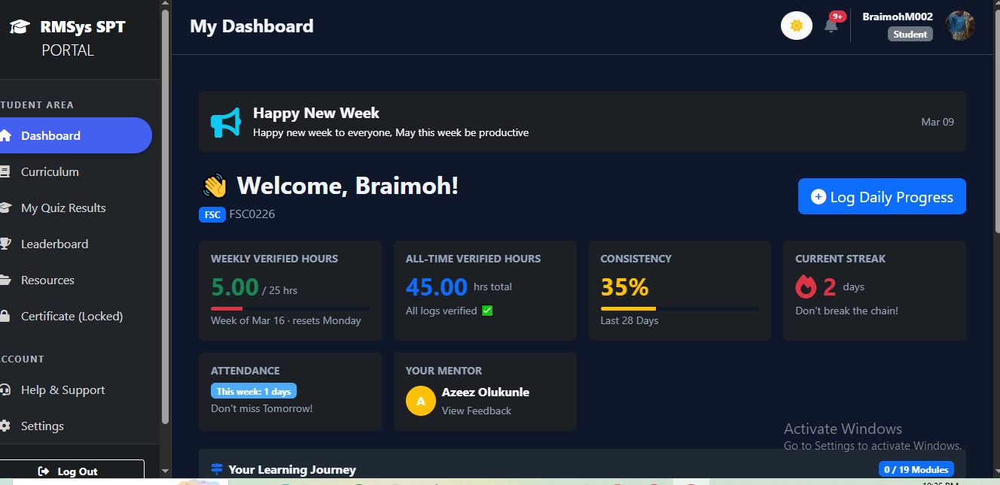
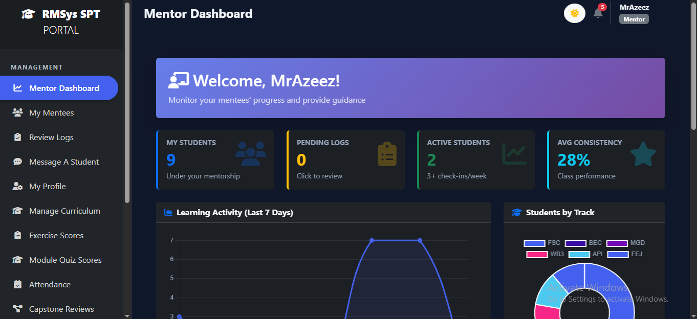
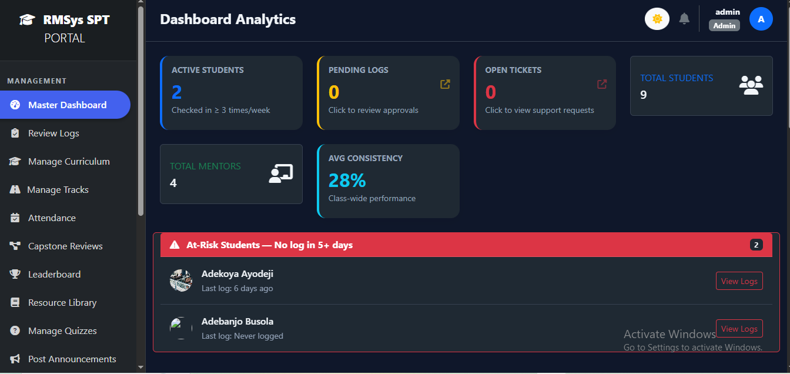
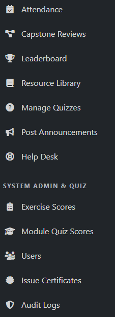
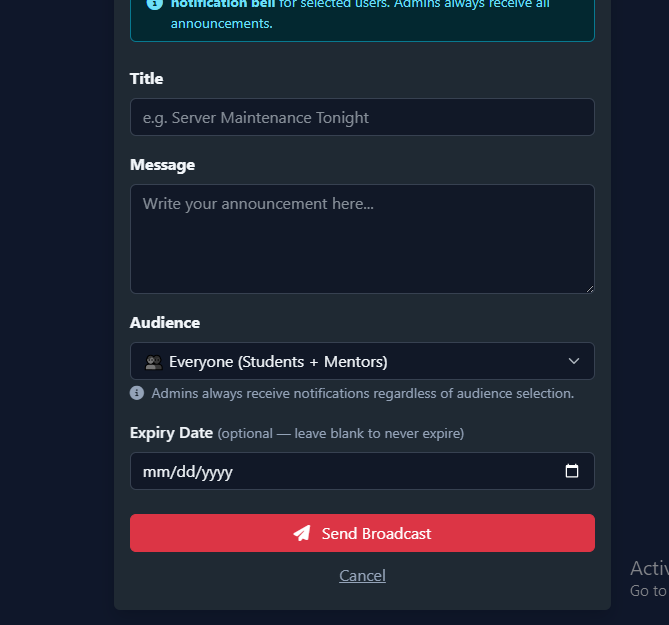
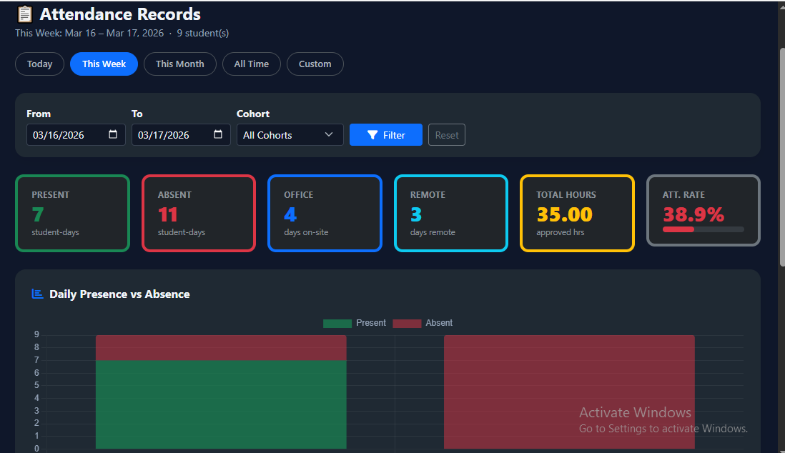
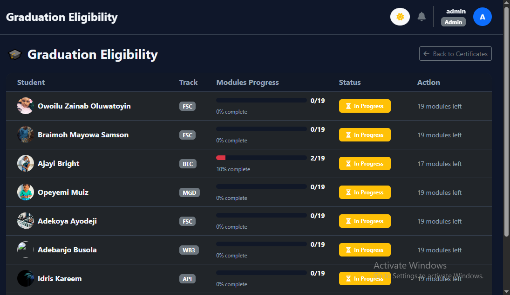
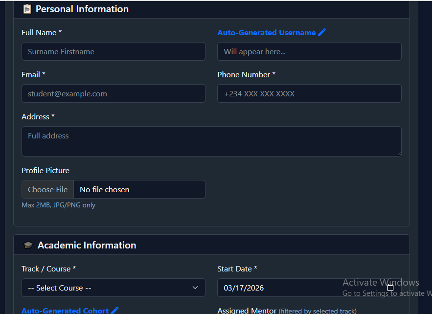
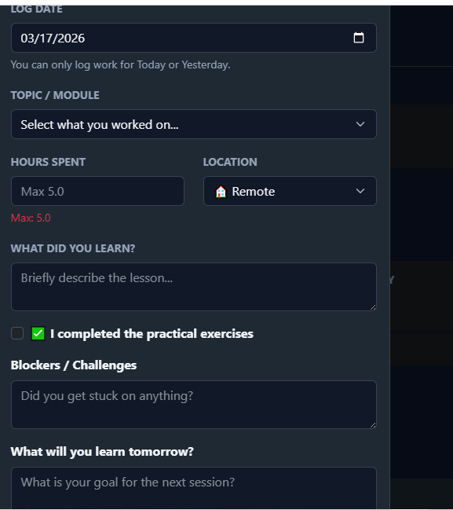
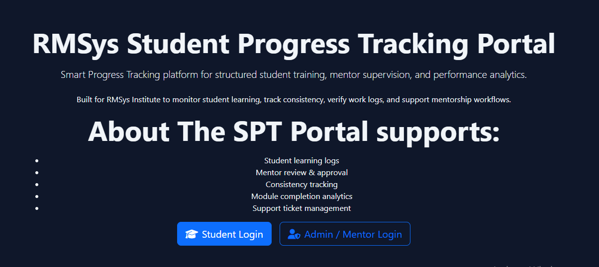
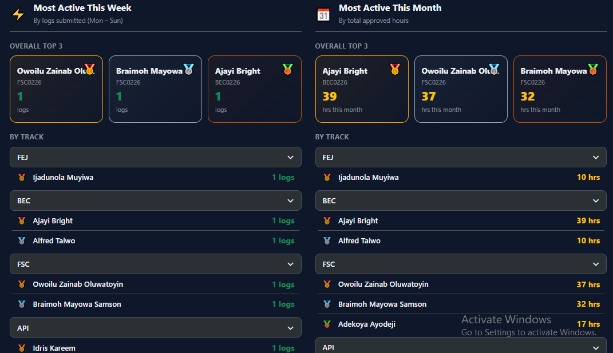
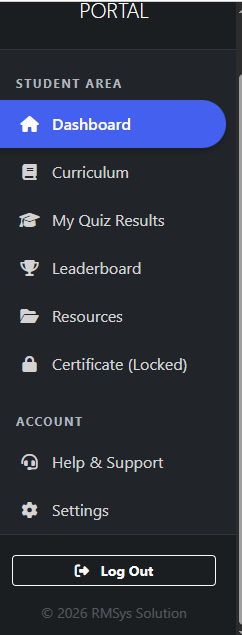
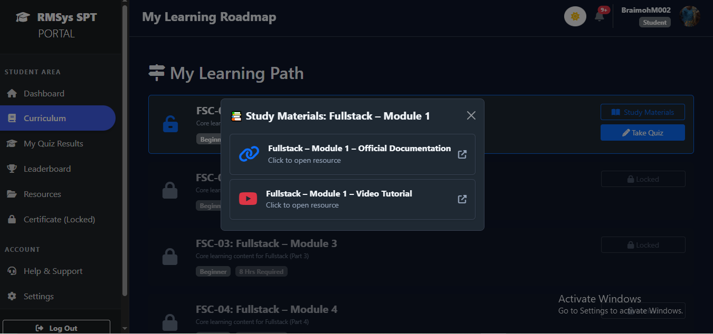
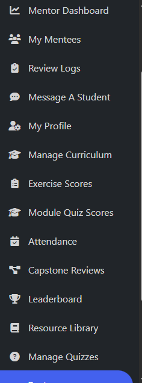
```

---

## 📄 License

This project was built by **Owoilu Zainab O** for RMSys Solutions, for internal use. All rights reserved.

---

<p align="center">Built with ❤️ for RMSys Solutions · Powered by ASP.NET Core & PostgreSQL</p>